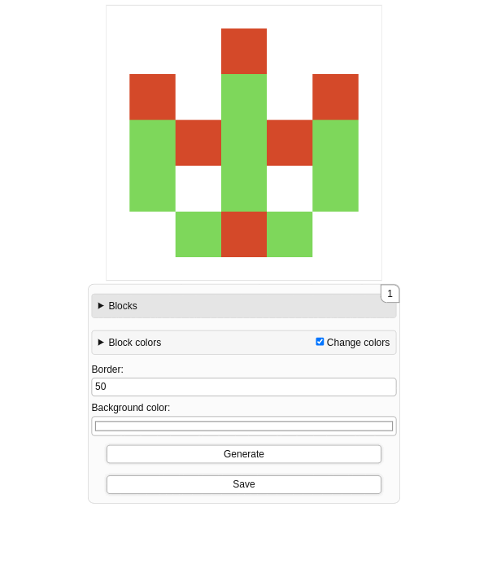
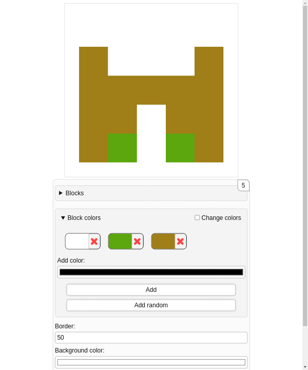
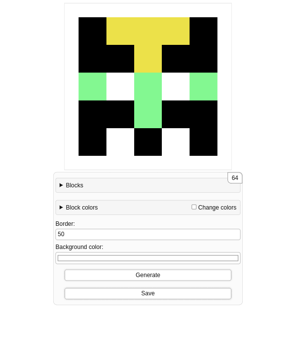
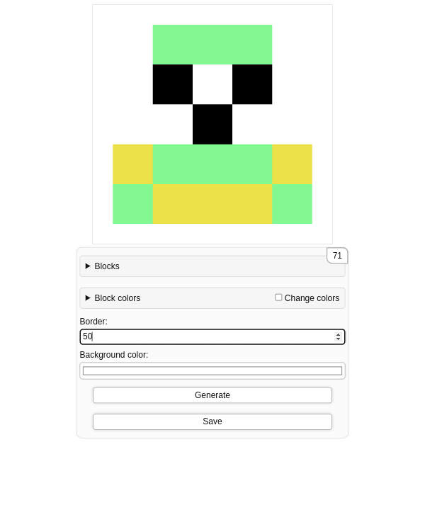
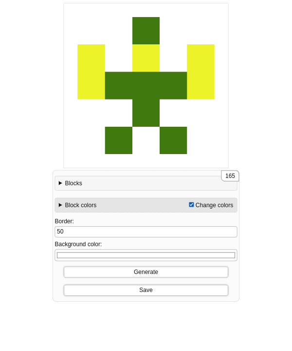
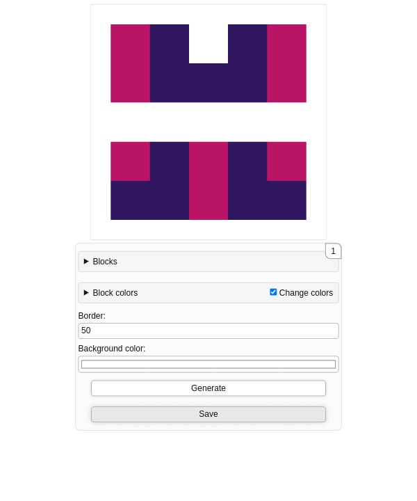

# GitHub Style Avatar Generator

This project is hosted on [GitHub Pages](https://gijs-d.github.io/GitHub-Style-Avatar-Generator/).

## Description

This project creates dynamic GitHub-style avatars using a grid of colored blocks on an HTML canvas. Users can customize the number of blocks, their sizes, colors, and other options through an interactive form. The generated avatar can also be saved as an image.

## Features

-   **Block Customization**: Specify the number of blocks in both X and Y directions.

-   **Size Settings**: Define the width and height of each block.

-   **Border and Background**: Choose a border size and background color for the avatar.

-   **Color Options**: Add custom colors or generate random colors for the blocks.

-   **Image Saving**: Save the generated avatar as a PNG image.

## Getting Started

To run the GitHub Style Avatar Generator locally, follow these steps:

1. Clone the repository or download the files.

2. Open `index.html` in your web browser.

## Usage

1. Open the `index.html` file in your browser.

2. Use the form to customize your avatar:

    - Set the number of blocks and their sizes.
    - Choose the border size and background color.
    - Add colors for the blocks or generate random colors.

3. Click the "Generate" button to create your avatar.

4. Click the "Save" button to download your avatar as a PNG image.

## Screenshots

